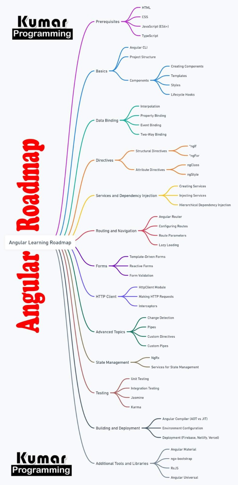

# Angular

## Volume 1

### Angular Basics

- **CLI**: Learn as you go.
- **Project Structure**: Learn as you go.

### Components - 8 hours

- Generate components using CLI.
- Understand single-file components via template, styles, and attributes.
- Implement MVC pattern in components.
- Master templates, styles, and services in components.

### Data Binding & Directives - 18 hours

#### Data Binding

- Interpolation
- Property binding
- Event binding
- Two-way binding

#### Directives

- Structural directives: `*ngIf`, `*ngFor`
- Attribute directives: `ngClass`, `ngStyle`

> Review Volume 2 for more details.

### Services & Dependency Injection - 8 hours

- Creating services
- Injecting services
- Hierarchical dependency injection

### Routing - 12 hours

- Angular Router basics
- Configuring routes
- Route parameters
- Route grades ( protected route )
- Lazy loading

### Forms - 10 hours

- **Reactive Forms**
- Form validation
- Template-driven forms

### HTTP Client - 3 hours

- HttpClientModule
- Making HTTP requests
- Interceptors

### Advanced Topics - 3 hours

- Change detection
- Pipes

#### +4 hours from Volume 2

- Custom directives
- Custom pipes

### State Management - 4 hours

- NgRx
- Services for state management

### UI Library

- Angular Material: Learn as you go.
- PrimeNG: Learn as you go.
- tailwind - 3 hours

### assignment

> under review

## Volume 2

### Directives - 3 hours

#### Control Flow

- `@if`
- `@for`
- `@else`
- `@defer` (Deferrable Views)
- `@placeholder`
- `@loading`

### Optimizing Images - 30 minutes

- NgOptimizedImage
- `[ngSrc]`

### RxJS - 16 hours

- Observables
- Operators
- Subjects
- Best practices

## Volume 3

### Angular Universal - 3 hours

- Server-side rendering (SSR)
- Prerendering
- @angular/platform-browser

### Testing - 20 hours

- Jest: Learn the API
- Vitest
- Angular testing integration

### Other Modules

- Angular animations
- Angular internationalization
- Angular without ZoneJS (zoneless)
- Angular signals
